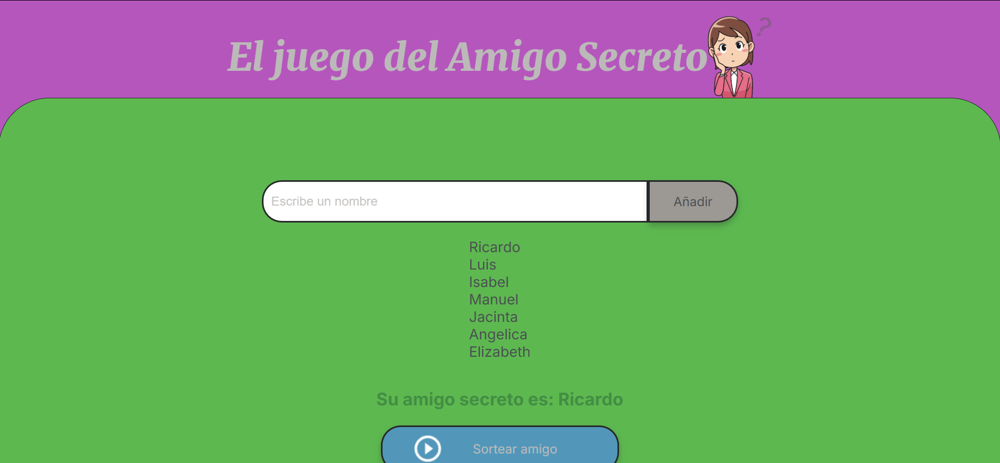
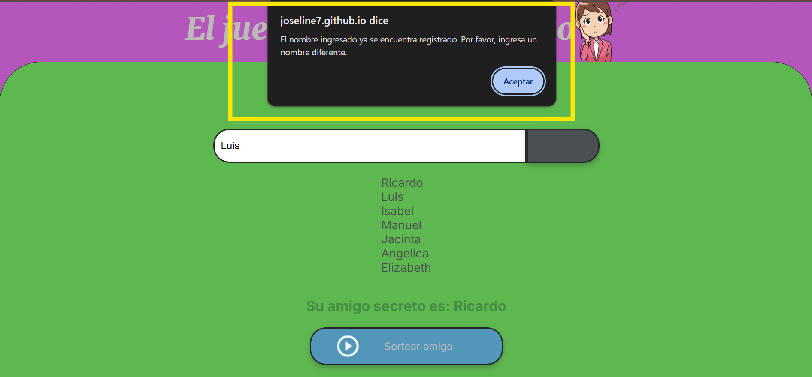

# Proyecto-1-G8-ONE
Proyecto 1: Se realiza el challenge titulado Amigo secreto  donde se pone a prueba los conocimientos del la etapa de Formación de Porgramación.

El desarrollo tiene las siguientes características:

  1. Permite colocar la lista de personas que participan.
  2. El sorteo se realiza aleatoriamente las veces que sea necesarias
  3. El resultado final es entregar el nombre del amigo secreto.
     
La visualización será por medio de la siguiente página:

Restricciones:
1.No puedes ingresar un mismo nombre a una lista de amigo secreto
2.Puedes repetir el juego una vez se termine con el sorteo

